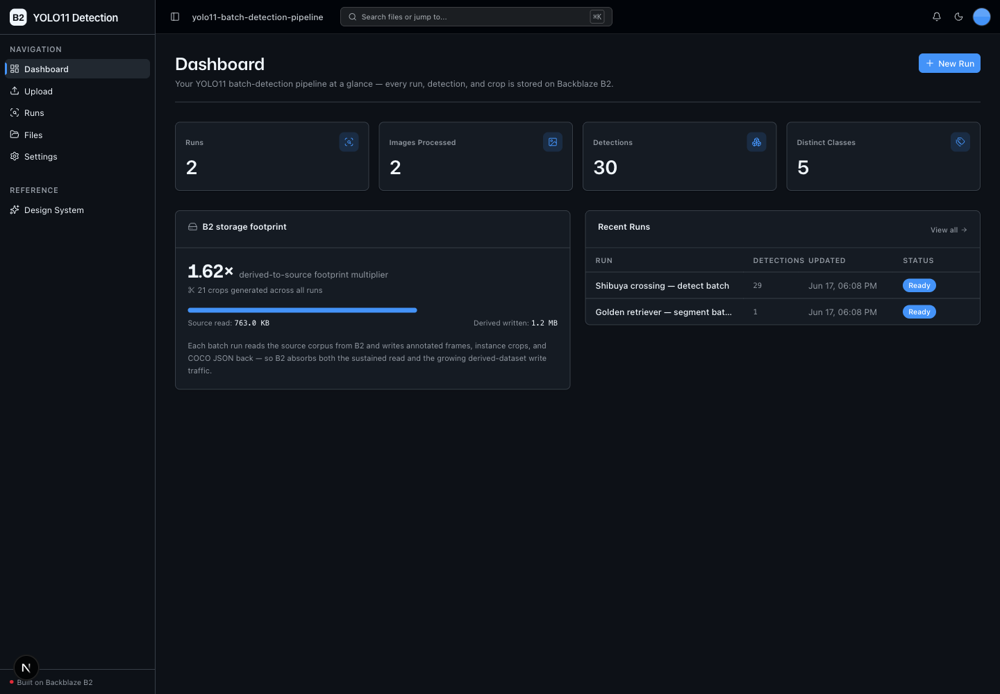
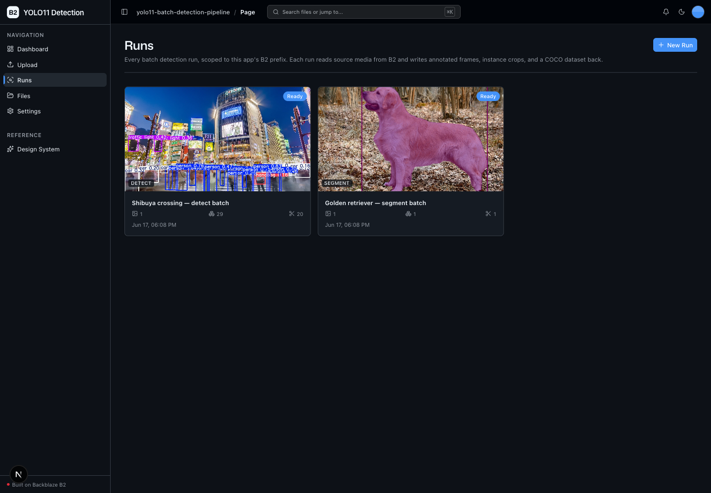
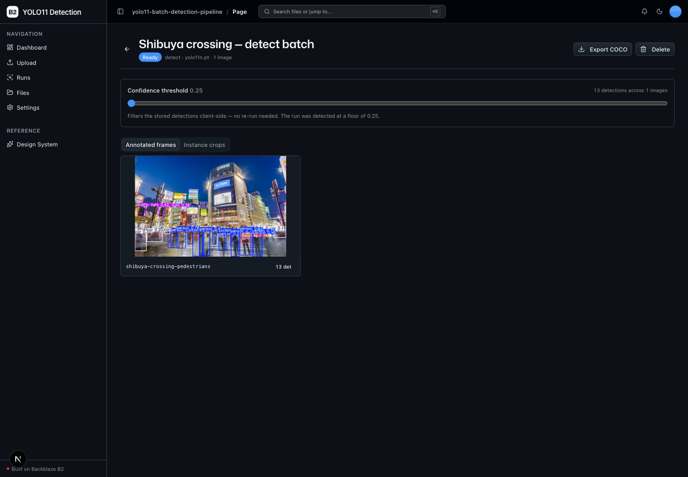
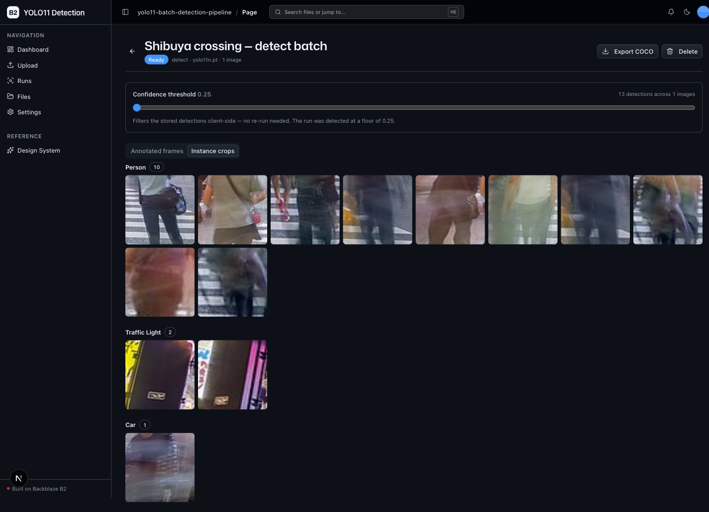

<!-- last_verified: 2026-05-01 -->
# YOLO11 Batch Detection Pipeline

A batch computer-vision pipeline for CV engineers and data teams who already keep
large image and video libraries on **[Backblaze B2](https://www.backblaze.com/sign-up/ai-cloud-storage?utm_source=github&utm_medium=referral&utm_campaign=ai_artifacts&utm_content=b2ai-yolo11-batch-detection-pipeline)**.
Point a **run** at a B2 source prefix; the backend reads the media over the
S3-compatible API, runs **[Ultralytics YOLO11](https://docs.ultralytics.com/models/yolo11/)**
locally (detect or segment), and writes three derived artifact families back to
B2 under a per-run prefix:

- **COCO-format detection JSON** — one file per image, plus a combined
  `instances.json` dataset you can export
- **Annotated frames** — boxes/labels (and masks, in segment mode) drawn on
  every source frame
- **Class-organized instance crops** — every detected object cropped and filed
  under its class

A thin UI browses results by **confidence threshold**, previews annotated frames
and crops via presigned URLs, and exports the COCO dataset — bootstrapping a
labeling project or powering a video-analytics pipeline.

Runs entirely on local OSS: **B2 credentials are the only secret** (no second
API key). YOLO11 weights auto-download on first use.

## What it looks like

**Dashboard** — pipeline metrics (runs, images processed, detections, distinct classes), the source-vs-derived B2 footprint multiplier, and a recent-runs table.



**Runs Library** — every batch detection run, scoped to this app's B2 prefix, with its source thumbnail, task, and detection/crop counts.



**Run detail — annotated frames** — the confidence-threshold slider re-filters stored detections client-side over a gallery of annotated frames.



**Run detail — instance crops** — every detected object cropped and grouped by class (person, car, traffic light).



## Why B2

Detection **multiplies the storage footprint** of the original corpus on every
batch run: source media in, annotated frames + COCO JSON + N crops per detection
out. B2 absorbs the sustained S3 **read** (source) and **write** (artifacts)
traffic for the whole pipeline, and the dashboard surfaces the live
source-vs-derived footprint multiplier so the cost story is visible.

## How it works

```
Upload / existing B2 prefix          Backblaze B2 (S3-compatible)
        │                            yolo11-batch-detection-pipeline/
        ▼                              source/                     ← run input
  POST /runs ──► BackgroundTask        runs/{run_id}/
        │         LISTING                manifest.json             ← status + index
        │         DETECTING  ◄── YOLO11  coco/{stem}.json          ← per-image COCO
        │         ANNOTATING             coco/instances.json       ← combined dataset
        │         CROPPING               annotated/{stem}.jpg      ← drawn frames
        ▼         READY                  crops/{class}/{stem}-{n}.jpg
  GET /runs/{id}  (poll)        ◄────────────────────────────────  presigned previews
```

The pipeline is async (FastAPI `BackgroundTasks`). Each run's `manifest.json` on
B2 is the **single source of truth** — there is no database and no queue.

### B2 key layout

Everything lives under `settings.run_prefix` (`yolo11-batch-detection-pipeline/`):

```
yolo11-batch-detection-pipeline/
  source/                          # /upload target + default run source prefix
  runs/{run_id}/
    manifest.json                  # status + summary index (sole source of truth)
    coco/{stem}.json               # per-image COCO detections
    coco/instances.json            # combined COCO dataset (export artifact)
    annotated/{stem}.jpg           # annotated frames
    crops/{class}/{stem}-{n}.jpg   # class-organized instance crops
```

The Runs Library (`/runs`) lists only this prefix; the full-bucket File Explorer
(`/files`) browses everything. Deletes are scoped to a single run's prefix.

## Agent-First Architecture

This repo is optimized for coding agents. The structure follows the principle
that **repository knowledge is the system of record** — everything an agent
needs to reason about the codebase is versioned, co-located, and discoverable.

**[AGENTS.md](AGENTS.md) is the single source of truth for all coding agents.** It
gives the repository layout, architectural invariants, commands, conventions,
and pointers to deeper docs. Architecture is enforced **mechanically** —
layering rules, import boundaries, file-size limits, and SDK containment are
verified by structural tests and lints on every change.

| Principle | Implementation |
|-----------|---------------|
| Single source of truth for agents | AGENTS.md — layout, invariants, commands |
| Enforce invariants mechanically | Structural tests + ruff + ESLint verify boundaries |
| Strict layered architecture | `types -> config -> repo -> service -> runtime` |
| Contain external SDKs | `boto3`/`ultralytics`/`cv2` only in `repo/` — verified by test |
| Keep files agent-sized | 300-line limit per file, enforced by test |
| Docs updated with code | Same-PR requirement prevents documentation rot |
| Structured observability | JSON logging, `/metrics` endpoint, request tracing |

## Quick Start

You need: Node.js >= 20.9.0, pnpm >= 9, Python >= 3.11, and a free **[Backblaze B2 account](https://www.backblaze.com/sign-up/ai-cloud-storage?utm_source=github&utm_medium=referral&utm_campaign=ai_artifacts&utm_content=b2ai-yolo11-batch-detection-pipeline)**.

### Setup

**1. Install frontend dependencies**

```bash
pnpm install
```

**2. Set up the backend (installs Ultralytics YOLO11 + OpenCV)**

```bash
cd services/api
python -m venv .venv && source .venv/bin/activate
pip install -r requirements.txt   # pulls ultralytics (and torch) — a few hundred MB
cd ../..
```

> First run downloads the YOLO11 weights automatically (`yolo11n.pt`, ~6 MB) —
> no API key required. A GPU is optional; the default nano model is CPU-friendly.

**3. Add your B2 credentials**

```bash
cp .env.example .env
```

Open `.env` and fill it in from the [Backblaze B2 dashboard](https://secure.backblaze.com/b2_buckets.htm?utm_source=github&utm_medium=referral&utm_campaign=ai_artifacts&utm_content=b2ai-yolo11-batch-detection-pipeline):

1. **Create a bucket** →
   - **Bucket Unique Name** → `B2_BUCKET_NAME`
   - **Endpoint** → `B2_ENDPOINT` (e.g. `https://s3.us-west-004.backblazeb2.com`)
   - the region in the endpoint → `B2_REGION` (e.g. `us-west-004`)
2. **Create an application key** with `Read and Write` permission →
   - **keyID** → `B2_APPLICATION_KEY_ID`
   - **applicationKey** → `B2_APPLICATION_KEY` *(only shown once)*

| Env var | Required | What it is |
|---------|----------|------------|
| `B2_ENDPOINT` | yes | S3 endpoint URL for your bucket's region |
| `B2_REGION` | yes | Region string (matches the endpoint, e.g. `us-west-004`) |
| `B2_APPLICATION_KEY_ID` | yes | Application key ID |
| `B2_APPLICATION_KEY` | yes | Application key secret |
| `B2_BUCKET_NAME` | yes | Bucket the pipeline reads from / writes to |
| `B2_PUBLIC_URL` | no | Public base URL (only if the bucket is public) |

**4. Run it**

```bash
pnpm dev
```

Frontend at `localhost:3000`, API at `localhost:8000`. Upload an image, open
**Runs**, start a detection run against `yolo11-batch-detection-pipeline/source/`,
and watch the annotated frames, crops, and COCO dataset land on B2.

`pnpm dev` runs `pnpm doctor` first — a preflight check that catches the common
setup gotchas (wrong Node/Python version, missing venv, missing or placeholder
`.env`, ports already taken). Run it standalone any time with `pnpm doctor`.

## Building Your App

Keep the shared scaffolding and only swap out what's app-specific:

- **Keep** the UI kit (`apps/web/src/components/ui/` + design tokens + `/design`).
- **Keep** the File Explorer (`/files`) and Upload (`/upload`) pages.
- **This app adds** the Runs Library (`/runs`), run detail with the confidence
  slider, and the pipeline dashboard.

Full contract and rationale: [AGENTS.md §2](AGENTS.md#2-building-on-this-app).

## Core Features

- [Batch Detection Runs](docs/features/batch-detection.md) — point a run at a B2 prefix; YOLO11 detect/segment over the whole batch
- [COCO Output](docs/features/coco-output.md) — per-image + combined `instances.json` dataset on B2
- [Annotations & Crops](docs/features/annotations-and-crops.md) — annotated frames + class-organized crops (the footprint multiplier)
- [Runs Library](docs/features/runs-library.md) — scoped explorer, confidence-slider browsing, presigned previews, dataset export
- [File Upload](docs/features/file-upload.md) — drag-and-drop source media into the `…/source/` prefix
- [File Browser](docs/features/file-browser.md) — full-bucket list, preview, download, delete
- [Dashboard](docs/features/dashboard.md) — pipeline metrics + B2 footprint multiplier
- [Design System](docs/design-system.md) — tokens, primitives, loaders, error/empty states. Live preview at `/design`.

## Tech Stack

- TypeScript, Next.js 16, React 19, Tailwind v4, shadcn/ui
- TanStack Query — caching, dedup, retry for every fetch
- Python 3.11+, FastAPI, boto3, Pydantic v2
- **Ultralytics YOLO11** (detect/segment), OpenCV, Pillow, NumPy — all confined to `app/repo/`
- Backblaze B2 (S3-compatible object storage)
- pnpm workspaces (monorepo)

## Commands

| Command | What it does |
|---------|-------------|
| `pnpm dev` | Start frontend + backend |
| `pnpm dev:web` | Frontend only |
| `pnpm dev:api` | Backend only |
| `pnpm build` | Build frontend |
| `pnpm lint` | Lint frontend |
| `pnpm lint:api` | Lint backend (ruff) |
| `pnpm test:api` | Run backend tests |
| `pnpm check:structure` | Verify layering rules |
| `pnpm test:e2e` | Playwright e2e tests (run `pnpm --filter @yolo11-batch-detection-pipeline/web exec playwright install chromium` once first) |

## Documentation Map

| Doc | Purpose |
|-----|---------|
| [AGENTS.md](AGENTS.md) | Agent table of contents — start here |
| [ARCHITECTURE.md](ARCHITECTURE.md) | Pipeline stages, B2 layout, layering, data flows |
| [docs/features/](docs/features/) | Feature docs (detection, COCO, crops, runs, upload, browser, dashboard) |
| [docs/app-workflows.md](docs/app-workflows.md) | User journeys |
| [docs/dev-workflows.md](docs/dev-workflows.md) | Engineering workflows and testing |
| [docs/SECURITY.md](docs/SECURITY.md) | Security principles |
| [docs/RELIABILITY.md](docs/RELIABILITY.md) | Reliability expectations |
| [docs/exec-plans/](docs/exec-plans/) | Execution plans and tech debt tracker |

## License

MIT License - see [LICENSE](LICENSE) for details.

## Claude Agent B2 Skill

Manage Backblaze B2 from your terminal using natural language (list/search, audits, stale or large file detection, security checks, safe cleanup).

Repo: [https://github.com/backblaze-b2-samples/claude-skill-b2-cloud-storage](https://github.com/backblaze-b2-samples/claude-skill-b2-cloud-storage)
